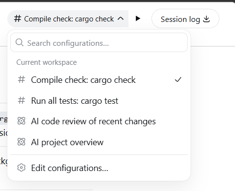
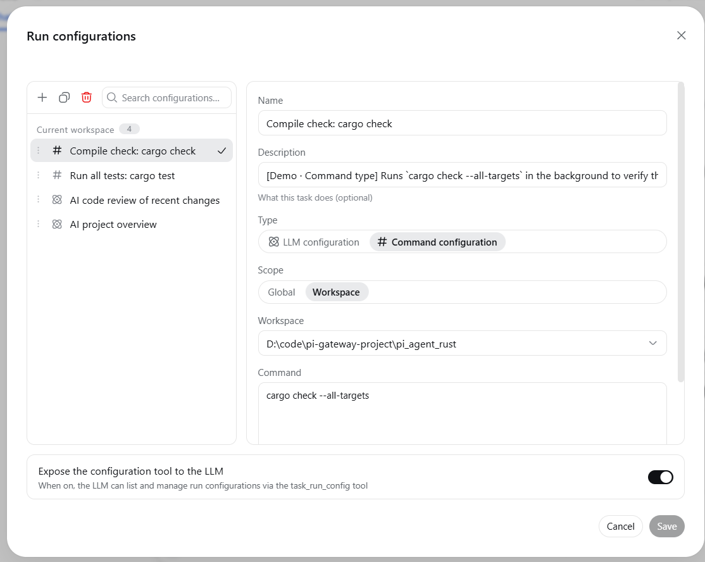
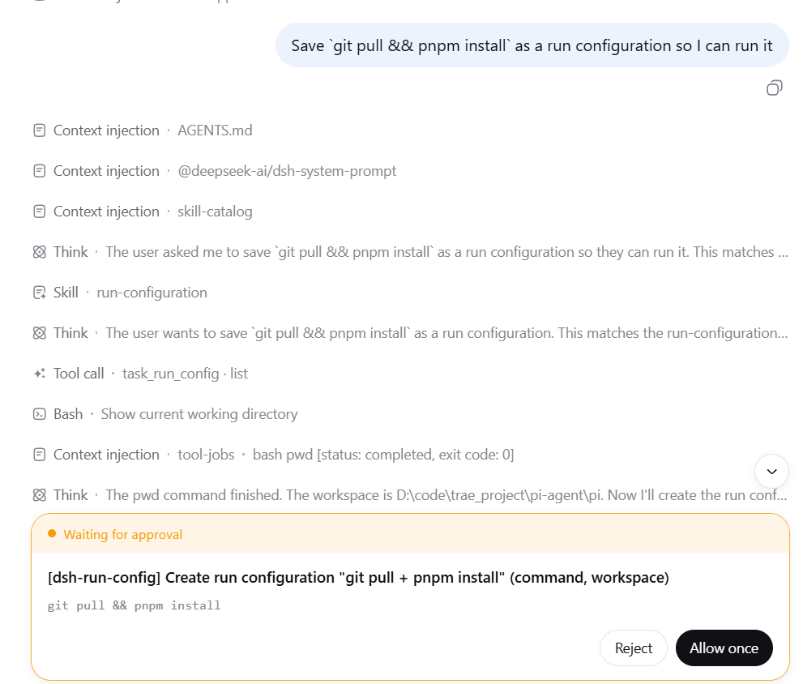

# dsh-run-config — Run Configuration Management for DeepSeek Harness

English | [中文](README.md)

Run configuration management for the DeepSeek Harness Web: like an IDE, save frequently used
LLM prompts and shell commands as "task run configurations" and launch them
with one click from the session header and the new-session page.



## Features

- **Session-header run control**: task picker + run button, with a hover
  tooltip showing which configuration will run
- **Run-configuration management**: IDEA-style dialog to create / edit /
  duplicate / delete / reorder configurations
  - Two types: **LLM configuration** (fills the composer with a prompt and
    sends it) and **command configuration** (runs a shell command in the
    background and notifies the LLM when it finishes)
  - Two scopes: **global** (visible in every workspace) and **workspace**
    (visible only in the declared workspace)
- **New-session run control**: pick and run a configuration before entering
  a session (**LLM configurations only** — a command configuration needs an
  existing session working directory and runs from the session header)
- **LLM integration**: the model can list and manage configurations through
  the `task_run_config` tool (write actions go through the standard
  approval flow — **in full-access mode the official semantics skip it**);
  detailed usage is loaded on demand via the `run-configuration` skill



## Usage example

Just say it in a session:

> Save `git pull && pnpm install` as a run configuration so I can run it
> with one click later

The model calls the `task_run_config` tool to create a command
configuration (write actions show an approval prompt — unless the session
runs in full-access mode), and once created you can pick it from the session
header and run it with one click.



## Recommended environment & setup

- **Run under full access**: use this plugin with the `danger-full-access`
  preset to avoid sandbox errors that can occur when running command
  configurations in some scenarios.
- **Background-task manager plugin**: [DSH-better-sidebar](https://github.com/omdsh-dev/DSH-better-sidebar)
  provides a background-task page to inspect and manually terminate tasks.

## Installation

### From npm (recommended)

```sh
dsh plugin --profile web add @xiaoso/dsh-run-config

dsh web
```

### Local development

```sh
dsh plugin --profile web add link:<path-to-this-repo>
```

### From GitHub

```sh
dsh plugin --profile web add github:xiaoso456/dsh-run-config
```

Git installs run this package's `prepare` script to build the artifacts;
with pnpm ≥10 the first `add` may fail and ask you to allow the build in the
profile's `pnpm-workspace.yaml`.

## Requirements

- **Node.js** ≥ 22 (per the `engines` field in `package.json`)
- **Git Bash** (recommended): recommended shell environment on Windows
- Built for the DeepSeek Harness `dsh` **0.2.0-rc.2** (this package's `peerDependencies` pins `0.2.0-rc.2` exactly; dsh's plugin version gate compares with `includePrerelease` semantics, so **this plugin's row is disabled whenever the runtime version differs**). On the dsh 0.2.0-rc.1 line install `@xiaoso/dsh-run-config@0.2.1`, on the 0.1.7 line install `0.2.0`, on the 0.1.5 line install `0.1.5`

## Build

```sh
pnpm install
pnpm build
```

## License

[MIT](LICENSE)
