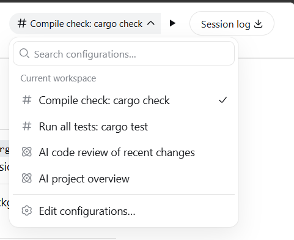
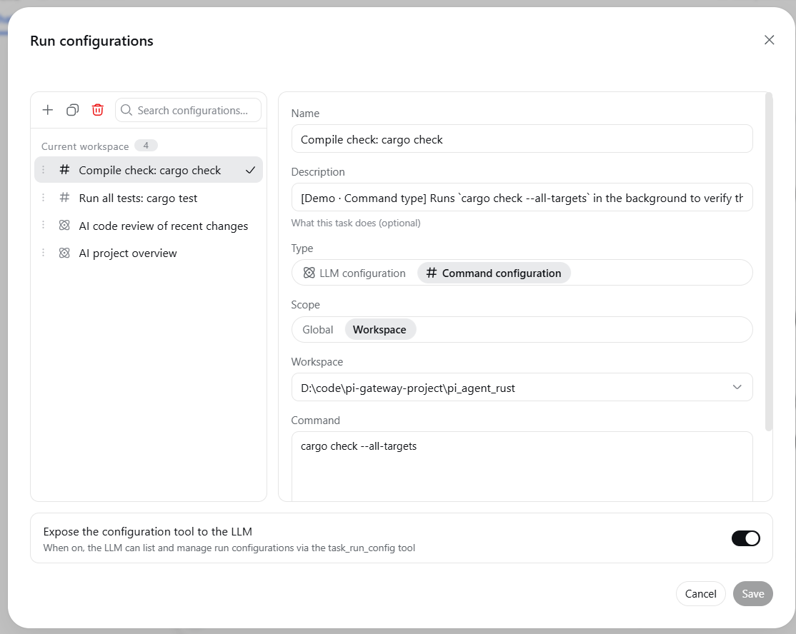
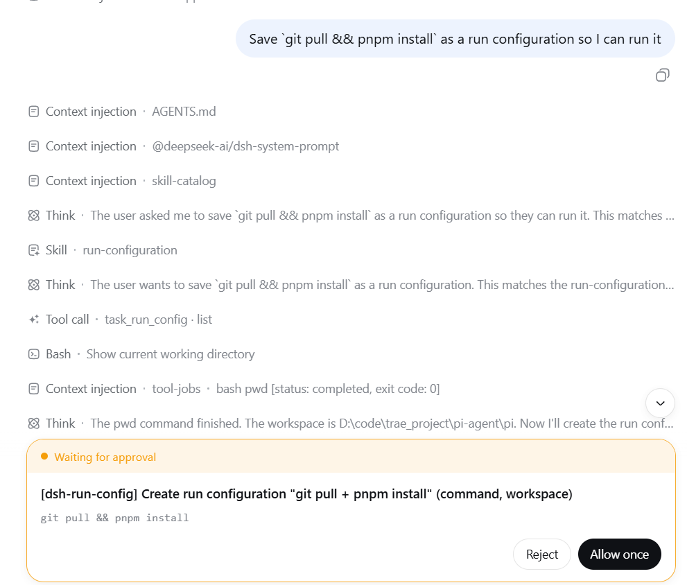

# dsh-run-config — DeepSeek Harness 运行配置管理

[English](README.en.md) | 中文

DeepSeek Harness Web 的运行配置管理：像 IDE 一样，把常用的 LLM 提示词和 Shell 命令保存为"任务运行配置"，在会话页和新会话页一键运行。



## 功能特性

- **会话头部运行控制**：任务选择器 + 运行按钮，悬浮提示当前将运行的任务配置
- **运行配置管理**：IDEA 风格对话框，创建 / 编辑 / 复制 / 删除 / 排序运行配置
  - 两种类型：**LLM 任务配置**（运行后把 Prompt 填入输入框并发送）、**命令任务配置**（后台执行 Shell 命令，完成后通知 LLM）
  - 两种作用域：**全局**（所有工作区可见）、**工作区**（仅当前工作区可见）
- **新会话页运行控制**：未进入会话时也能选择并运行任务配置
- **LLM 集成**：大模型可通过 `task_run_config` 工具查看和管理运行配置（写操作走标准审批流程），详细用法通过 `run-configuration` skill 按需加载



## 使用示例

在会话里直接说：

> 把 `git pull && pnpm install` 保存为任务配置，以后一键运行

大模型会调用 `task_run_config` 工具创建命令任务配置（写操作会弹出审批确认），创建后即可在会话头部选择并一键运行。



## 推荐环境与配置

- **完全权限模式**：建议在 `danger-full-access`（完全权限）下使用本插件，可避免部分场景下运行命令配置出现的沙箱错误。
- **任务后台管理插件**：[DSH-better-sidebar](https://github.com/omdsh-dev/DSH-better-sidebar) 提供后台任务页，可查看并手动终止后台任务。

## 安装

### 从 npm 安装（推荐）

```sh
dsh plugin --profile web add @xiaoso/dsh-run-config
dsh web
```

### 本地开发

```sh
dsh plugin --profile web add link:<本仓库路径>
```

### 从 GitHub 安装

```sh
dsh plugin --profile web add github:xiaoso456/dsh-run-config
```

git 安装会跑本包的 `prepare` 脚本构建产物；pnpm ≥10 会在首次 `add` 失败并提示在 profile 的 `pnpm-workspace.yaml` 里允许该构建。

## 环境要求

- **Node.js** ≥ 22（`package.json` 的 `engines` 要求）
- **Git Bash**（推荐）：Windows 上推荐使用 Git Bash 作为 shell 环境
- 适用于 DeepSeek Harness `dsh` v0.1.1-rc.2（pre-release，接口可能变动）

## 构建

```sh
pnpm install
pnpm build
```

## License

[MIT](LICENSE)
